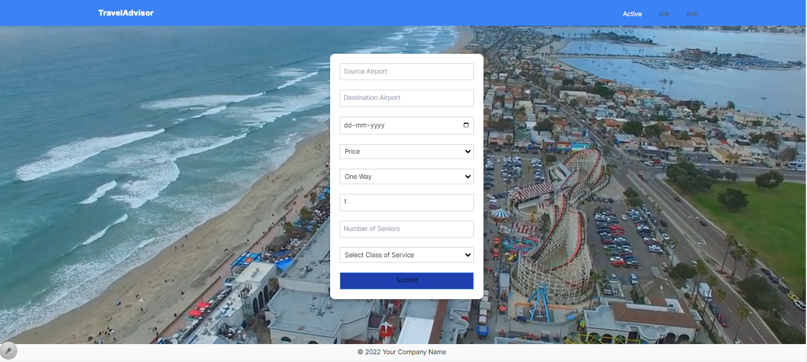

# Flight Search Website

This is a flight search website built with Next.js and React. It uses the TripAdvisor API to fetch flight data based on user input.

## Features

- Search flights by source and destination airports, date, itinerary type, sort order, number of adults and seniors, and class of service.
- Display flight results with detailed information.
- Responsive design.

## Installation

1. Clone the repository:
git clone https://github.com/yourusername/yourrepository.git

2. Install the dependencies:
cd yourrepository npm install

3. Start the development server:
npm run dev

4. Open [http://localhost:3000](http://localhost:3000) with your browser to see the result.

## Usage

Fill in the form with your desired flight details and click "Submit". The flight results will be displayed below.

## Screenshot

    

## Contributing

Pull requests are welcome. For major changes, please open an issue first to discuss what you would like to change.

## License

[MIT](https://choosealicense.com/licenses/mit/)
